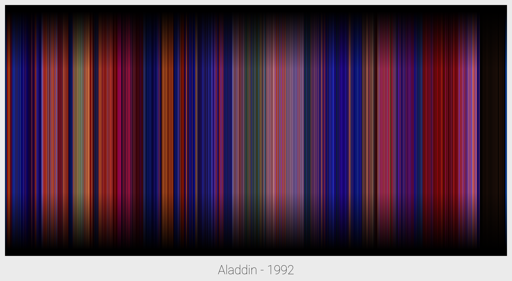

#Average Video Colour

Takes each frame of a given video and compresses its average color into a single vertical line, creating a timeline of the spectrum of colors used throughout each video

##Sample Images

##Installation

Installation is very simple. You will need Python, obviously then first install the pip requirements with:

`pip install -r requirements.txt`

It may be helpful to create a virtual env for this to live in, instructions on doing that can be found on the [virtualenv site](https://virtualenv.pypa.io/en/stable/installation/).

You will also need the *'ffmpg'* library which for mac users can be installed with HomeBrew:

`brew install ffmpg`

##Usage

To generate a colour timeline place a video in the **'video'** folder and run (for a video file named 'test.mp4'):

`python averageColour.py -v "video/test.mp4"`

This will run through the video and place each frame of the video in **'output/*videoName*/frames'**, it will also create a json file containing the average colour of each frame.

If you already have a set of frames, or a set of images you want to get the colour timeline of then you can place your frames or images in the **'output/*videoName/frames'** folder and run:

`python averageColour.py -f "videoName"`

You can also remake the image from the json file of frame averages by running, where *videoName* is the parent directory where the json file is contained:

`python averageColour.py -a "videoName"`

This is useful if, for example, you want to change the height of the output image and therefore means you don't have to compute the frame averages again, which can take a while for a long video.

All of these commands take an optional flag `-t`, this is to specify a title that will be shown on the output image, if none is given the titalised form of the input video name will be used, for the test video:

`python averageColour.py -v "video/test.mp4" -t "This Is A Test"`

